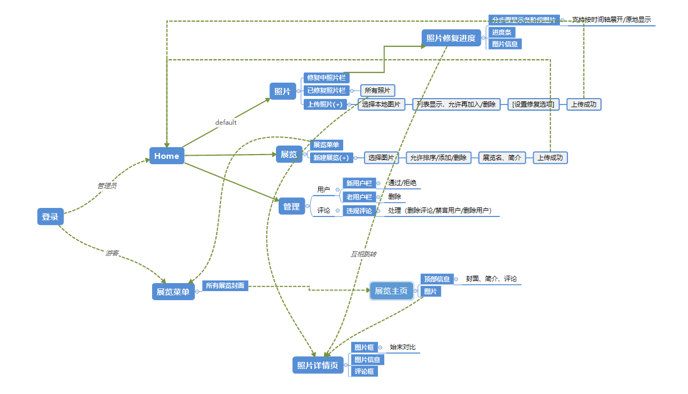
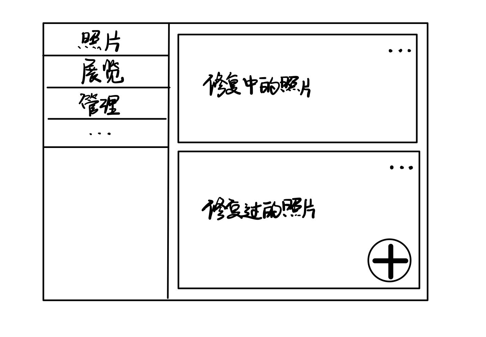
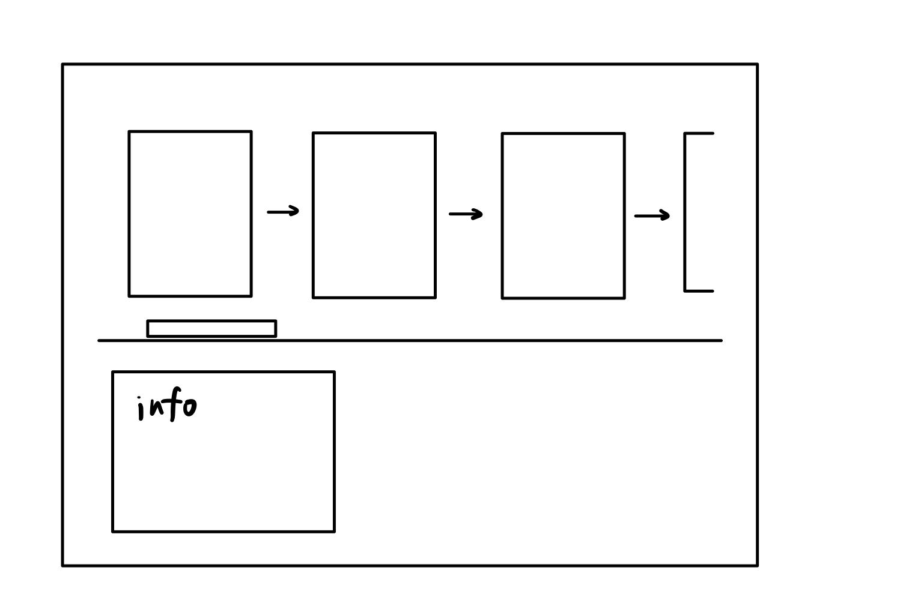
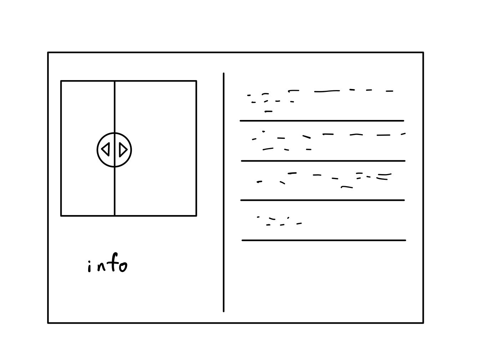
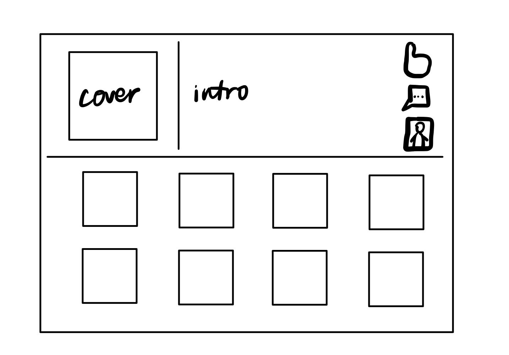

## 软工项目文档

——for **gc.dll**

### 一、目标效果

#### 1. 前端

基本网页路由如下：

关键页面示意图：

* 管理员Home页：

> 左侧为栏目按键，默认选中照片。右边为栏目内容，默认为照片。
>
> 需要设置显示所有（...）及醒目的提交新照片（"+"）按钮。

* 照片修复进度页：
> 需要水平拖动条查看不同阶段的修复效果。也需要支持合并为就地展示图片的变化（通过一个按钮切换）。
>
> 修复中的和修复完的图片都使用这种显示布局（修复完=100%修复中）。还需要表示修复进度的**进度条**，可能能与**拖动条**合并。
>
> 需要支持和“照片详情”页互相跳转。

* 照片详情页：

> 左右滑动对比前后效果。
>
> 需要支持和“照片修复进度”页相互跳转。

* 展览页：

> 点击“评论”图标查看展览评论，点击“照片”图标显示展览照片（共用下放的显示位置）。
>
> 此图仅供参考，可能能够使用更丰富的布局，如历史长廊、时空柱、回环等。

对于**批量显示和管理**的页面（展览/照片/评论/用户）可能能够实现一种通用模板，点击“编辑”后可以进行增删改查（管理员限定）。

此外，所有页面具备相同的**顶部导航栏**，集成**搜索框**和**排序器**。不同的页面中搜索框、排序器的作用范围加以区别（所有展览/所有照片/该展览下的照片）。

所有页面都还需要更丰富的角落设计（后期迭代的任务）。

#### 2. 后端

后端的路由部分需要正确连接前端的各个网页跳转，功能实现在`urls.py`和`views.py`文件中。此外，需要引进Django鉴权系统，防止未登录用于通过输入url直接跳转。需要和前端对接请求的协议（后期再进行）。对于涉及IO的部分，用（与负责数据管理同学协商好的）函数名代替，待实现。

后端的数据部分需要先实现ORM模型构建（`models.py`），正确表示各个model（照片、展览、评论、标签、用户）的外键（ForeignKey）关系。还要实现一些操作数据的函数（放在一个另外的文件里，如`io.py`），供`views.py`调用，如读写评论、调用API修复图片等。实际上涉及数据的本地存储和与飞桨API的交互。

### 二、开发规范

#### 1. git

* 开发新feature的对应git操作：branch新分支，开发完毕后向dev提交merge request。
  * 如果是issue，组长会开好分支，直接使用即可。
* 所有组员均为maintainer权限，**不要向master/dev直接push/merge**，只提交merge request，等组长随后处理。
* **本地分支混乱**无法恢复的话，不要向远程push，否则可能造成远程仓库混乱的麻烦（~~reset~~）。
* 不要在项目中添加无关的文件（尤其是二进制文件），必要时可配置**.gitignore**。
* 开发前养成**先pull**的习惯（~~如果不想merge conflict的话~~）。
* comment规范：**全英文，一般用Add/Change/Remove开头，不加结尾句号；对应issue的comment需要加$\#+issue\ id$字样**。
* 相邻commit改动不要太大，多commit少改。

#### 2. 代码

* 变量、函数用**蛇形命名**（eg:`store_photos()`）。
* 函数写中文doc，解释功能和参数含义。必要的代码（逻辑难以理解处）添加中文注释。
